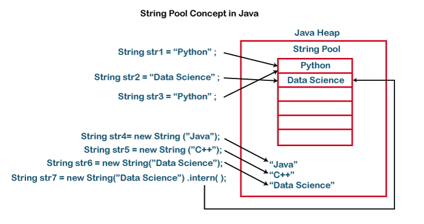

## ITEM 10 - eqauls는 일반 규약을 지켜 재정의하라.

❗️ 재정의해야 할 때는 두 객체가 물리적으로 같은가가 아니라, 상위 클래스의 equals가 논리적 동치성을 비교하도록 재정의 되지 않았을때입니다.

❓ 논리적 동치성(logical equality) 이란   
두 객체가 논리적으로 동등한가를 판단하는 개념

`equals` 메서드는 모든 Java 객체의 최상위 클래스인 `Object` 클래스에 정의되어 있습니다.   
기본 구현은 객체의 레퍼런스(주소)가 같은지를 비교하지만, 많은 클래스들은 이 메서드를 재정의하여 객체의 내용(값)이 같은지를 비교하도록 구현합니다.

### `equals` 메서드 재정의 동치관계

1. 반사성(Reflexivity): 모든 객체는 자기 자신과 논리적으로 동일해야 합니다.    
- `x.equals(x)`는 항상 `true`

2. 대칭성(Symmetry): 두 객체 A와 B가 논리적으로 동일하다면, B와 A도 논리적으로 동일해야 합니다.
- `A.equals(B)`가 `true`라면, `B.equals(A)`도 `true`

3. 추이성(Transitivity): 세 객체 A, B, C가 논리적으로 동일하다면, A와 C도 논리적으로 동일해야 합니다. 
- `A.equals(B)`와 `B.equals(C)`가 둘 다 `true`라면, `A.equals(C)`도 `true`

4. 일관성(Consistency): 객체의 내용이 변경되지 않는 한, 
- `equals` 메서드 호출 결과는 항상 동일

5. null 비교: `null`과 비교할 때에도 NullPointerException이 발생하지 않고, `false`를 반환해야 합니다. 
- `x.equals(null)`은 항상 `false`

Java에서 많은 클래스들은 `equals` 메서드를 적절하게 재정의하여 논리적 동치성을 제공합니다. 예를 들어, `String`, `Integer`, `Double` 등의 클래스들은 객체 내용의 동일성을 비교하도록 재정의되어 있습니다. 이러한 논리적 동치성을 통해 객체들을 의미있게 비교하고 데이터 구조에 활용할 수 있습니다.

### `eqauls` 재정의를 도와주는 프레임 워크 AutoValue
구글에서 만든 프레임워크로 `eqauls` 재정의를 클래스 어노테이션으로 해결해준다.

하지만, 구글의 AutoValue를 대체할 수 있는 프로젝트가 Lombok 프로젝트라고 한다.
- @EqualsAndHashCode

### 결론
- 되도록 재정의하지 않는게 좋다.
- Object의 equals가 대부분 원하는 비교를 정확히 수행해준다.    
- 재정의해야 할 때는 그 클래스의 핵심 필드 모두를 빠짐없이, 다섯 가지 규약을 확실히 지켜가며 비교해야 한다.

### System.identityHashCode 메서드
객체의 해시 코드(hash code)를 반환하는데, 이 해시 코드는 해당 `객체의 메모리 주소`를 기반으로 계산됩니다.    
객체의 실제 데이터나 내용을 기반으로 한 것이 아니라 객체의 물리적인 위치를 나타내는 값이라고 볼 수 있습니다

### Reference
- https://www.baeldung.com/introduction-to-autovalue
- https://www.javatpoint.com/string-pool-in-java

